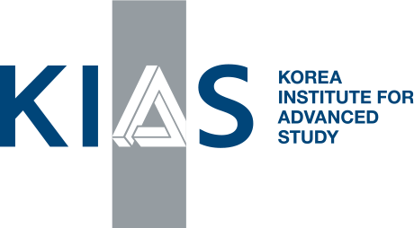
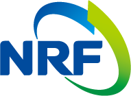

<!---->

## Quantum Resources 2025
<h3 class="lessspace"><em>Jeju, 17 &ndash; 21 March 2025</em></h3>

Quantum resource theory is a burgeoning field at the intersection of quantum physics and information theory, dedicated to understanding and quantifying the valuable resources that enable quantum technologies to surpass classical counterparts. These resources, such as entanglement, coherence, and magic, are pivotal for advancements in quantum computing, cryptography, and communication. Rigorous characterization and quantification of these quantum resources have deepened our understanding of quantum foundations and explored their implications for thermodynamics, leading to the development of new theoretical frameworks and practical protocols that harness their full potential.

Quantum Resources 2025 brings together leading experts and emerging voices in the field to explore the latest theoretical insights, practical applications, and future directions of quantum resource theory, fostering collaboration and innovation at the forefront of quantum science.

The conference will be **held in person** to enhance active interactions. We look forward to seeing you on Jeju Island in March 2025.

This is a successor of the previous events, Quantum Resources, which took place in <a href = "https://2022.quantumresources.science">2022</a> (Singapore, hosted by Bartosz Regula) and <a href = "https://2023.quantumresources.science"> 2023 </a> (Singapore, hosted by Ryuji Takagi).

## Invited speakers
* **Alvaro Martin Alhambra** (Instituto de Fisica Teorica)
* **Ehud Altman** (The Chinese University of Hong Kong, Shenzhen)
* **Yingfei Gu** (Nagoya University)
* **Wenwei Ho** (University of Amsterdam & QuSoft)
* **Min-Hsiu Hsieh** (Ulsan National Institute of Science and Technology)
* **Hsin-Yuan (Robert) Huang** (National University of Singapore)
* **Hosho Katsura** (University of Tokyo)
* **Tomotaka Kuwahara** (National University of Singapore)
* **Ethan Lake** (Nanyang Technological University)
* **Zi-Wen Liu** (Cornell University)
* **Tibor Rakovsky**
* **Thomas Schuster**
* **Hayata Yamasaki**
* **Zhicheng Yang**
* **Yi-Zhuang You**
* **Pengfei Zhang**
<!--* **Andreas Winter** (Universitat Autònoma de Barcelona)-->

## Location

The workshop will take place at <a href="https://kias.re.kr/kias/main/main.do">Korea Institute of Advanced Study, Seoul </a>.

## Dates

All deadlines in Anywhere on Earth (AoE) time.

* Registration deadline: <s>20 April 2025</s> <s>2 June 2025</s>

* **Workshop: 23 &ndash; 27 June 2025**

## Organizing committee
* Hyukjoon Kwon (Korea Institute for Advanced Study)
* Seok-Hyung Lie (Ulsan National Institute of Science and Technology)

## Steering committee
* Bartosz Regula (RIKEN)
* Ryuji Takagi (University of Tokyo)

## If you have any questions, please contact below:
* Juhye Park (KIAS)  /  <a href="mailto:pjh999@kias.re.kr">pjh999@kias.re.kr</a> 
* Hyukjoon Kwon (KIAS)  /  <a href="mailto:hjkwon@kias.re.kr">hjkwon@kias.re.kr</a> 

## Sponsor
The workshop is sponsored by Quantum Universe Center, Korea Institute for Advanced Study (KIAS), National Research Foundation of Korea (NRF).

 

<b><i class="fas fa-exclamation-triangle"></i>&nbsp; Scam alert</b>

	
We have been notified that an unaffiliated email "Conferences@reservationsmanagement.org" is contacting participants about alleged accommodation bookings for the workshop. Please note that this is a scam, and <b>you will not be contacted by any third party on our behalf</b>.

