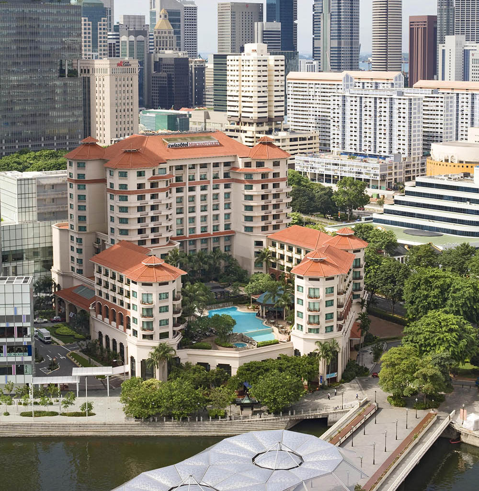

# Workshop venue
- The workshop will take place at <a href="https://www.glad-hotels.com/maisongladjeju/index.do?locale=en">MAISON GLAD JEJU</a>, located in the city center of Jeju Island, Korea.

# Getting there
<iframe src="https://www.google.com/maps/embed?pb=!1m18!1m12!1m3!1d3327.624548396652!2d126.48375958778261!3d33.485124504727395!2m3!1f0!2f0!3f0!3m2!1i1024!2i768!4f13.1!3m3!1m2!1s0x350cfb07b2f2ecf9%3A0xe969e73f7efcf19f!2z66mU7KKFIOq4gOuemOuTnCDsoJzso7w!5e0!3m2!1sko!2skr!4v1721552000626!5m2!1sko!2skr" width="600" height="450" style="border:0;" allowfullscreen="" loading="lazy" referrerpolicy="no-referrer-when-downgrade"></iframe>

## By Taxi
- From Jeju International Airport, it takes 15 minutes to get to the hotel.

## By Shuttle Bus
### Jeju International Airport → MAISON GLAD JEJU (10:30 / 15:30 / 19:30)
- Boarding location: Bus Parking Area B, at the Airport (near the parking tower)

### MAISON GLAD JEJU → Jeju International Airport (09:30 / 14:30 / 18:30)
- Boarding location: Parking lot in front of hotel lobby

### Notice
- Shuttle bus departs on time at all times (boarding ends 5 minutes before departure time)
- The shuttle bus service is subject to change depending on Hotel operation.

## By public transport 
- There are buses (Nos. 315, 316, 365, 322, 465, and 466) departing from Jeju International Airport that stop near the hotel, taking around 20 minutes.

